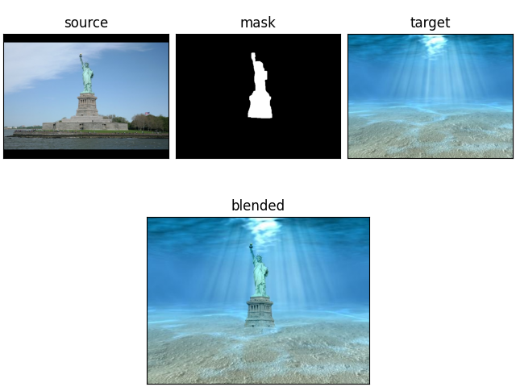

# multi-dimensional-poisson-blending

A multidimensional generalization of the seamless cloning algorithm suggested in Perez et al. (2003) [1], AKA Poisson Blending.

## Examples

### 2D

This repository includes three 2D example sets, demonstrated in both grayscale and RGB modes in `main.py`. RGB results are attached below:

<p align="center">



</p>

### 3D

The `main.py` script also generates a 3D example, where an MRI scan of a brain is blended into an MRI scan of a spinal cord. A screenshot of the blended 3D image, presented with `napari`, is attached below:

<p align="center"></p>

## Usage

To use the code, `git clone` this repository.
To install dependencies, run the following in a terminal window:

```
pip install -r requirements.txt
```

To blend grayscale images, use `PoissonBlending.Poisson2DBlender` or `PoissonBlending.Poisson3DBlender`.
Both classes expect `numpy` arrays as inputs. Loading images into acceptable formats is the user's
responsibility, and see `main.py` for working examples.

To blend RGB (or any other multichannel format) images, create an instance of any `PoissonBlender` (e.g., 
`Poisson2DBlender`, `Poisson3DBlender`) with colored images as inputs. Then use the `Colored` decorator class to add 
multichannel support. For example:

```python
from PoissonBlending import Poisson2DBlender, Colored

rgb_2d_blender = Colored(Poisson2DBlender(source, target, mask))
rgb_2d_blender.blend()
rgb_2d_blender.show_results()
```

Working examples can be found in `main.py`.

## Sources

- 2D implementation inspired by [`poissonpy`](https://github.com/bchao1/poissonpy) [2].
- The [OpenNeuro](https://openneuro.org/) [3] platform was used for 3D example images. Specifically, the brain image is from
  [Greco et al. (2024)](https://doi.org/10.18112/openneuro.ds005530.v1.0.8) [4] and the spinal cord image is
  from [Dabbagh et al. (2024)](https://doi.org/10.18112/openneuro.ds004926.v1.3.0) [5].

## References

[1] Pérez, P., Gangnet, M., & Blake, A. (2003). Poisson image editing. In ACM Transactions on Graphics, Volume 22, Issue 3
(pp. 313-318). doi: doi:10.1145/882262.882269

[2] https://github.com/bchao1/poissonpy

[3] https://openneuro.org/

[4] Viviana Greco and Tamas A. Foldes and Neil A. Harrison and Kevin Murphy and Marta Wawrzuta and Mahmoud E. A. Abdellahi and
Penelope A. Lewis (2024). Depotentiation of emotional reactivity using TMR during REM sleep. OpenNeuro. [Dataset] doi:
doi:10.18112/openneuro.ds005530.v1.0.8

[5] Alice Dabbagh and Ulrike Horn and Merve Kaptan and Toralf Mildner and Roland Mueller and Joeran Lepsien and Nikolaus
Weiskopf and Jonathan C.W. Brooks and Juergen Finsterbusch and Falk Eippert (2024). Reliability of taskbased fMRI in the dorsal
horn of the human spinal cord. OpenNeuro. [Dataset] doi: doi:10.18112/openneuro.ds004926.v1.3.0
